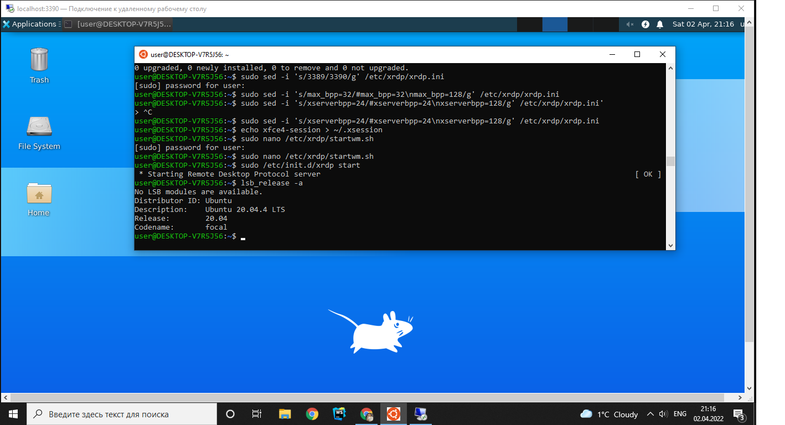
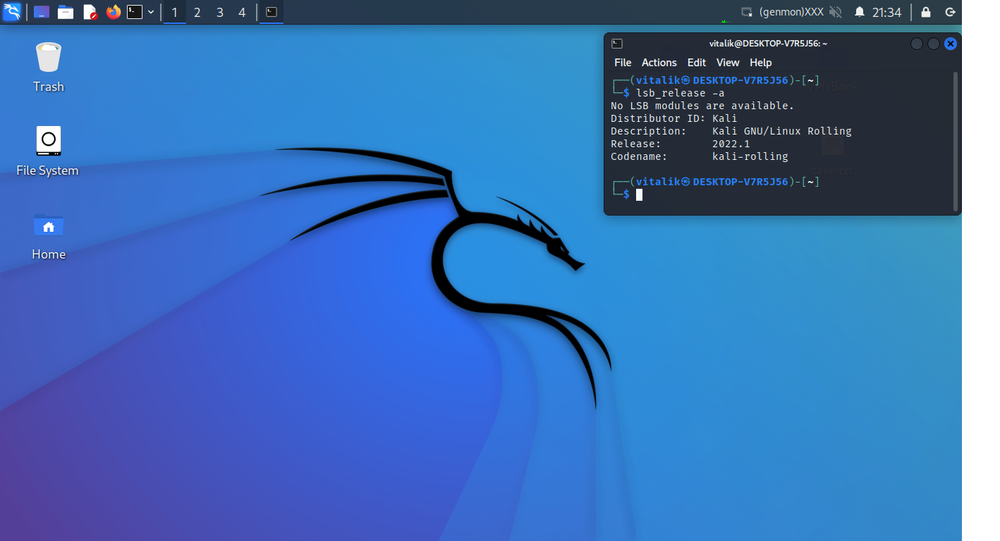
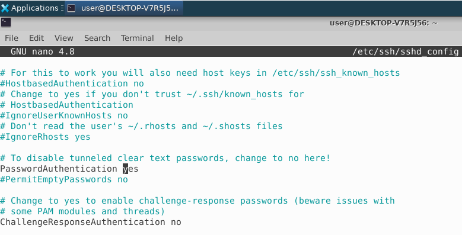
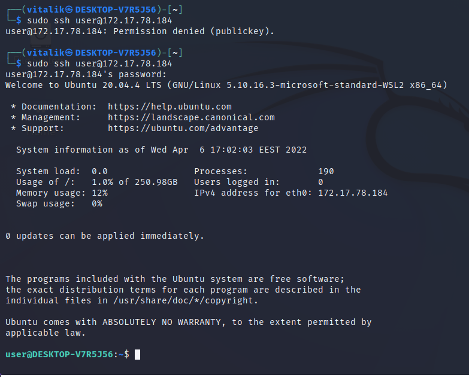
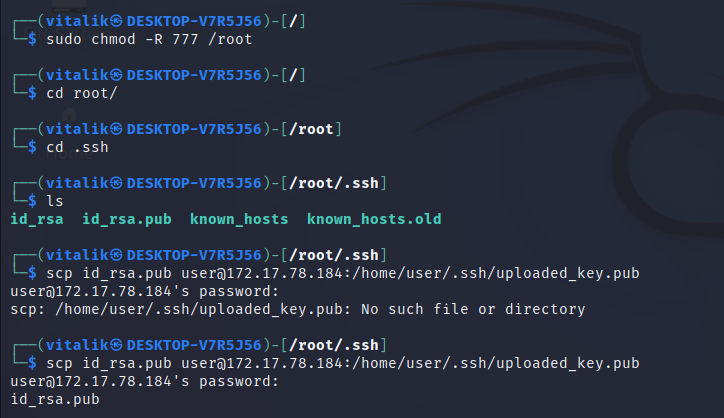
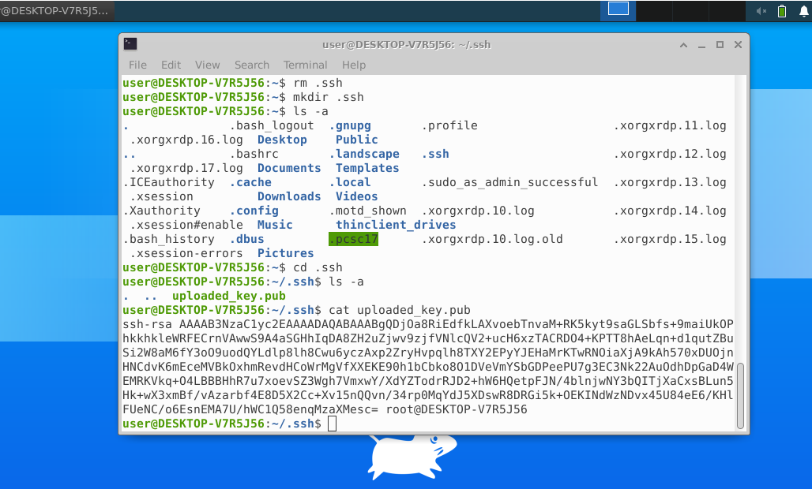
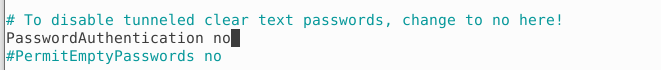
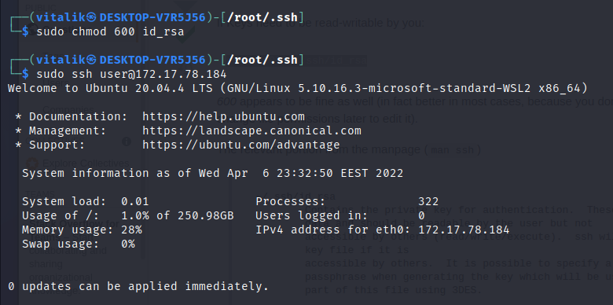

<details>
<summary>Ubuntu and Kali as Windows subsystems installed</summary>


<br/>

</details>
<br/>

<details>
<summary>
Established SSH connection with cleartext password authN
</summary>

#### Remote server
```diff
! Set PasswordAuth to Yes
```

<br/>

#### Client

</details>
<br/>

<details>
<summary>
Established SSH connection with public key
</summary>

#### Client

<br/>

#### Remote server

```diff
! It's important to create authorized_keys file containing keys
user@DESKTOP-V7R5J56:~/.ssh$ cat uploaded_key.pub >> authorized_keys
```
<br/>



#### Client

</details>
<br/>

<details>
<summary>
What is SSH port forwarding?
</summary>

<p>
SSH port forwarding is a mechanism in SSH for tunneling application ports from the client machine to the server machine, or vice versa. 
It can be used for adding encryption to legacy applications, going through firewalls,
and some system administrators and IT professionals use it for opening backdoors into the internal network from their home machines. 
It can also be abused by hackers and malware to open access from the Internet to the internal network.
</p>


</details>

