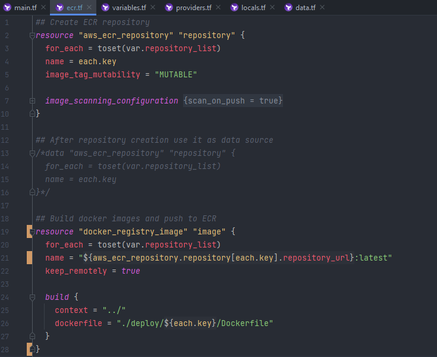
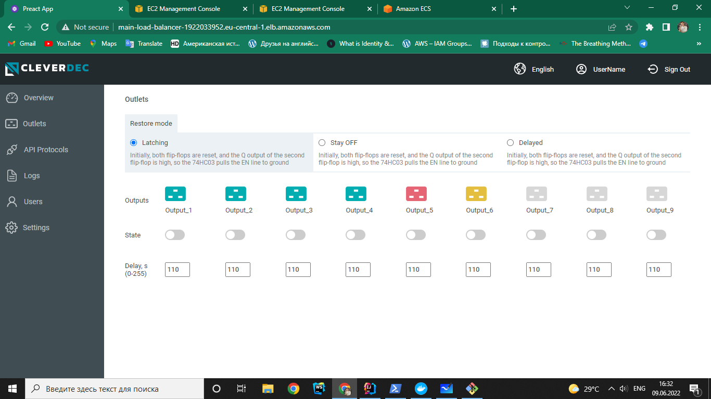
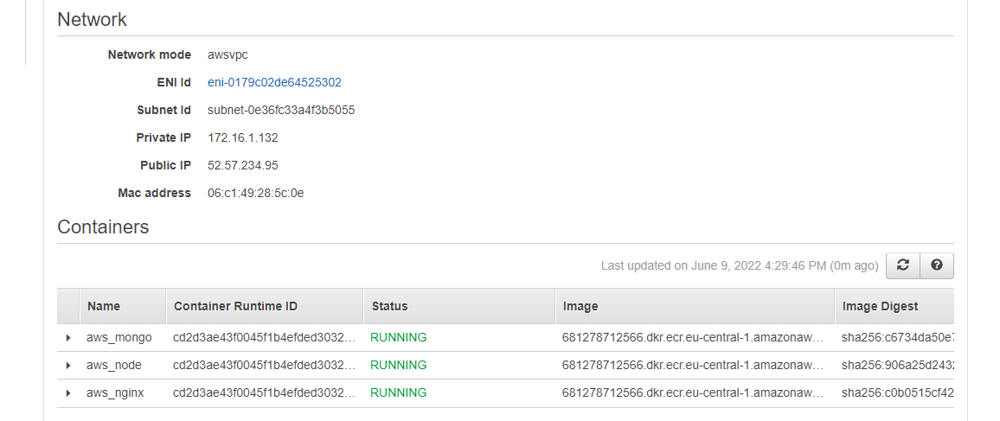

## Deploying an AWS ECS Cluster with Terraform

Registration and User creation

 

Also AWS CLI installed

 

Elastic Container Registry

#### AWS and docker provider configuration with credentials 

> `aws_caller_identity` and `aws_ecr_authorization_token` are data sources that automatically
exports credentials for an ECR

 

**ECR resources**

> For using repos as data source, the resources should be removed from state before switching

#### Created repositories:

 

**While building images, faced issue below and couldn't fix it.**

`docker_registry_image` strips the file permissions during handling of the context archive

https://github.com/kreuzwerker/terraform-provider-docker/issues/293

 
  
Thus i resorted to traditional method: built images using `docker-compose`,
tagged and push with `docker cli` commands

 

Elastic Container Service

 

**Adding this second service, i separated infra as follows:**

> So it consists of ECR and ECS modules with its own independent state  
and aws-base-module that represents abstraction

ECS module is too way contentful, so:
https://github.com/tsiotska/CloudTech-studying/tree/develop/terraform-aws/ecs-module

**For ECS there have been created next resources:**
* aws_iam_role (policy_arn: AmazonECSTaskExecutionRolePolicy)
* aws_ecs_cluster
* aws_ecs_service with load_balancer and network_configuration 
* aws_security_group for service network and load balancer
* aws_ecs_task_definition with containers definitions using mongo, node, nginx images from ecr
* aws_vpc with private and public aws_subnet
* private subnet with internet connectivity through nat gateway

 

****
 

**Running app (no bought dns name and https provided):**

***

