### Containerization stack initiated in `nginx` branch with docker and docker-compose

> Using docker-compose i am going to build nginx, node and mongo images, pass them to my linux subsystem and 
run multiple containers 

Added deploy folder so structure looks as follows: 

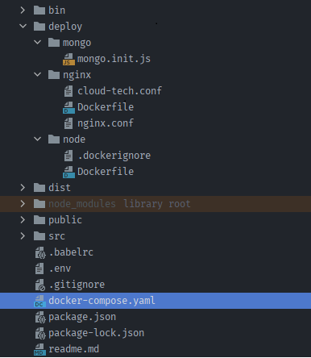

Created dockerfile for nginx that copies configuration
and static files, and runs nginx in the foreground when the built image is launched

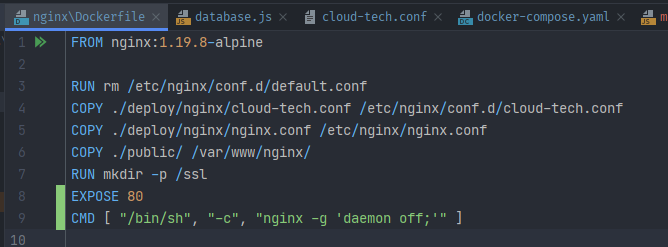

Created node docker file with production stage and opportunity 
to add development or sort of staging stage later. 
At present it installs dependencies and 
transpiles ES code by build command

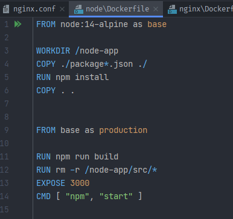

Changed proxy location to node service

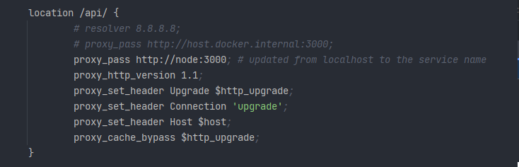

Nginx_conf that includes required config from above

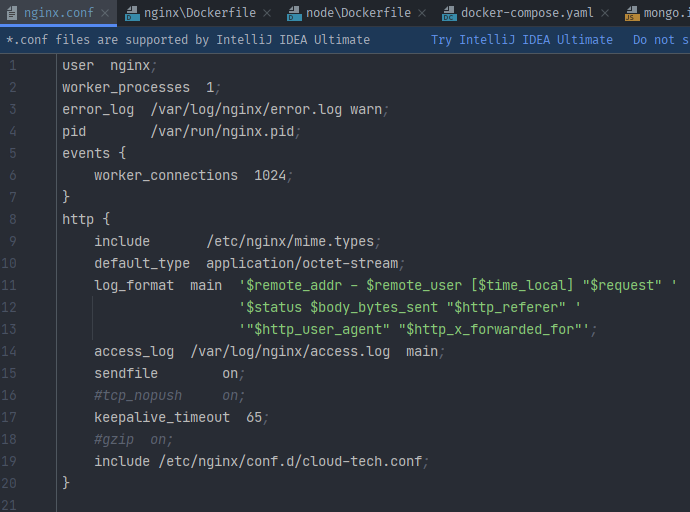

I created a user-defined bridge network so containers could be addressed by their names
(nginx proxy and database connection)


Docker-compose.yaml:

```docker-compose
version: "3"

services:
  mongo:
    image: mongo:5.0
    ports:
      - "27017:27017"
    volumes:
      # - /data/db:/data/db
      - F:/test-db-output:/data/db
      - ./deploy/mongo/mongo-init.js:/docker-entrypoint-initdb.d/mongo-init.js
    environment:
      - MONGO_INITDB_ROOT_USERNAME=root
      - MONGO_INITDB_ROOT_PASSWORD=1111
      - MONGO_INITDB_DATABASE=users
    restart: always
    networks:
      - app-network

  node:
    build:
      context: ./
      dockerfile: ./deploy/node/Dockerfile
      target: production
    ports:
      - "3000:3000"
    restart: always
    depends_on:
      - mongo
    networks:
      - app-network

  nginx:
    build:
      context: ./
      dockerfile: ./deploy/nginx/Dockerfile
    ports:
      - "80:80"
      - "443:443"
    volumes:
      # - /etc/nginx/ssl:/ssl
      - C:/Users/Vitaliy/ssl/:/ssl
    restart: unless-stopped
    depends_on:
      - node
    networks:
      - app-network

networks:
  app-network:
    external: true
```

Run `docker-compose up --build` to make sure it builds and runs in windows host machine.
Checked docker desktop:

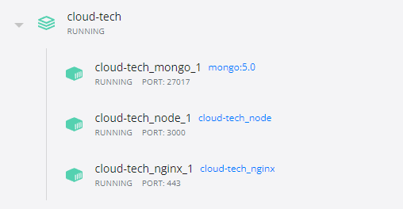

#### To run all containers in linux: 

Made sure there's docker WSL integration enabled with my distro 

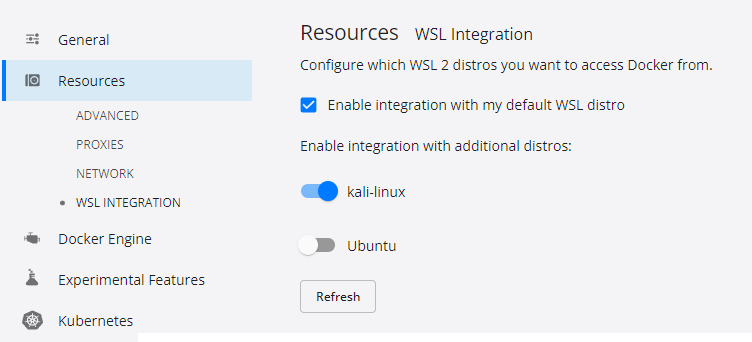

Verified that images are accessible

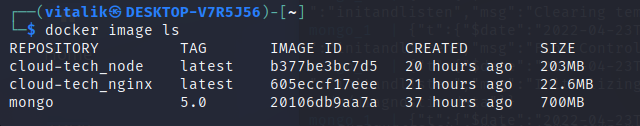

Copied DB init file and docker-compose
(it has changes, so it'd have been better to create a kind of compose.prod.yaml file)

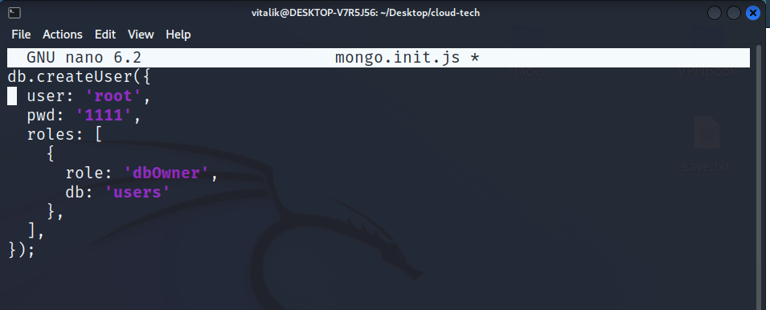

Compose file required some volumes paths changes (database and ssl)

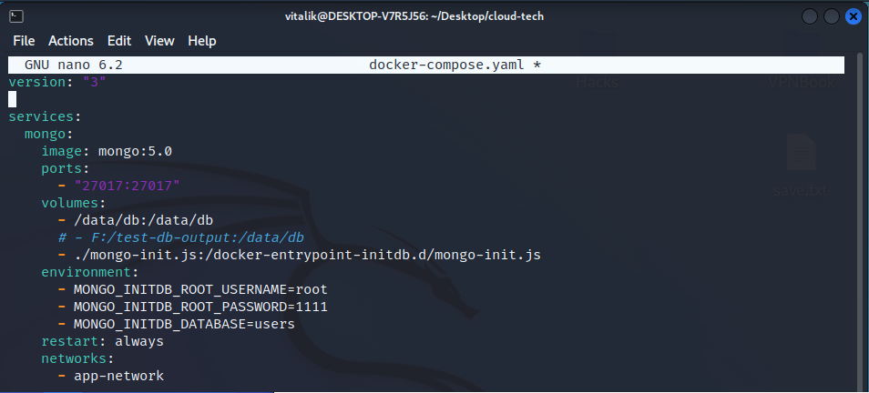

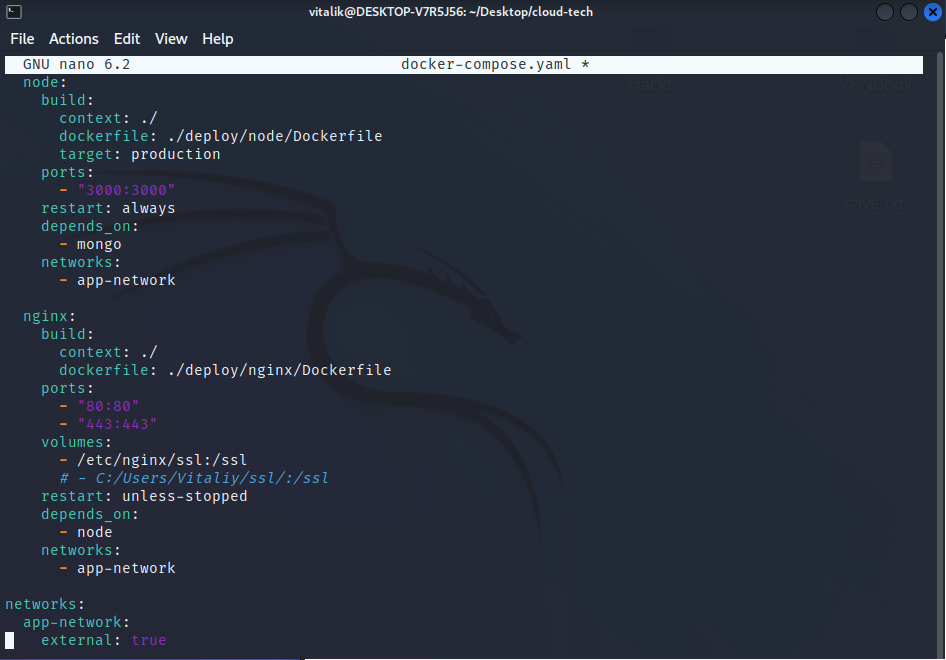

Without compose file, for instance, 
the mongo container running command would be next

```dockerfile
docker run -p 21017:21017 --net app-network \ 
-v /data/db:/data/db \
-v ~/Desktop/cloud-tech/mongo.init.js:/docker-entrypoint-initdb.d/mongo-init.js \
-e MONGO_INITDB_ROOT_USERNAME=root \
-e MONGO_INITDB_ROOT_PASSWORD=1111 \
-e MONGO_INITDB_DATABASE=users \
mongo:5.0
```

Finally it also runs in linux as well

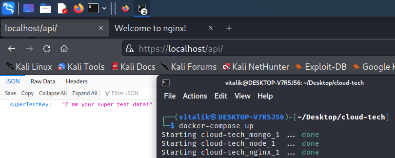
