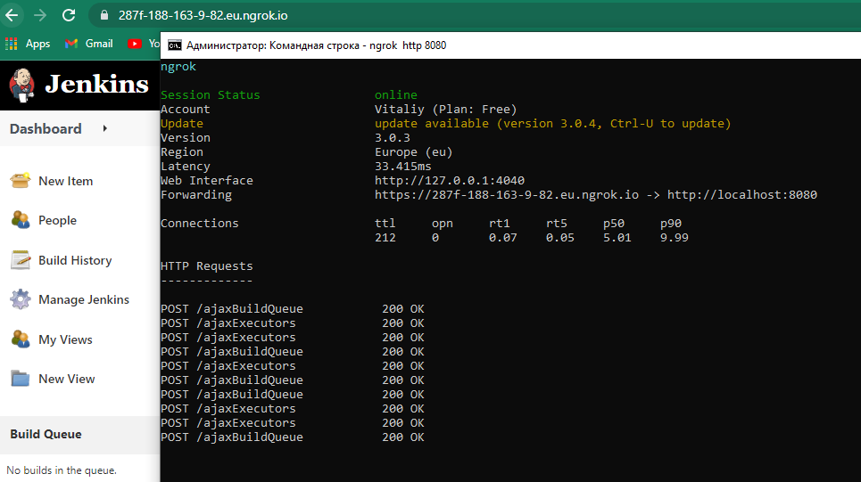
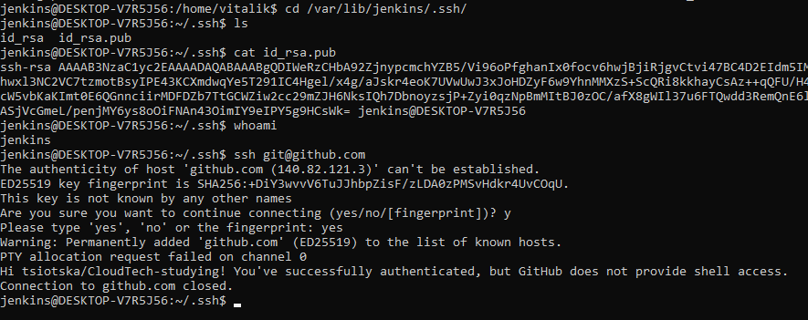
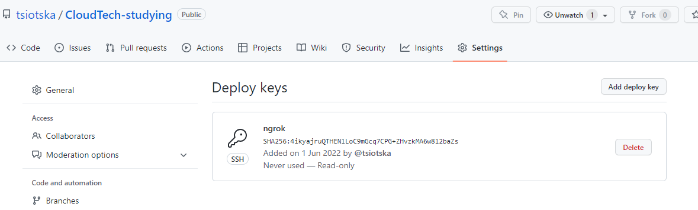
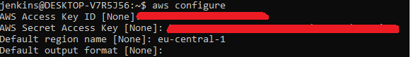
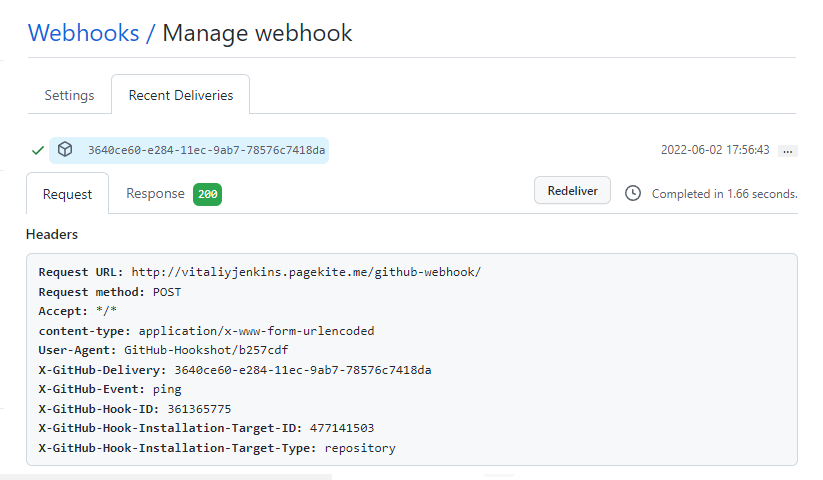
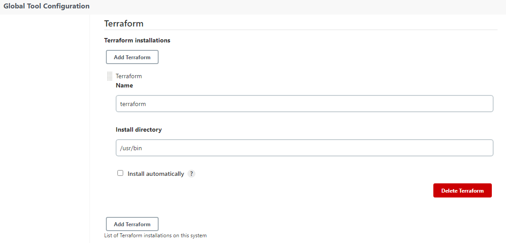
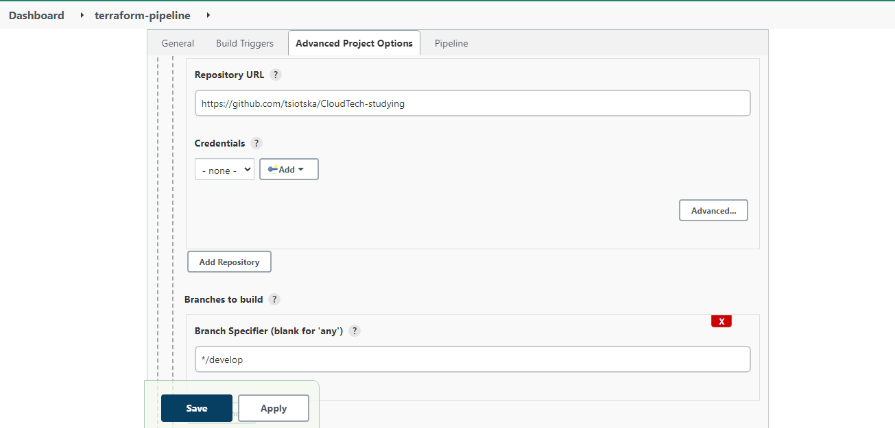
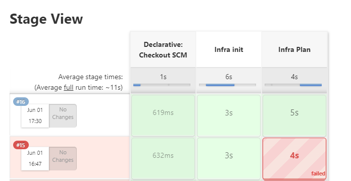
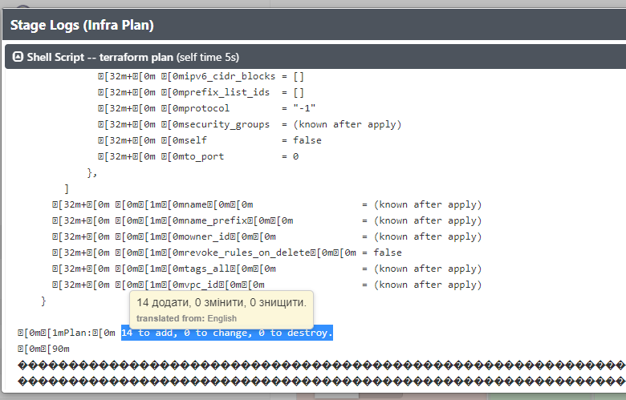

## Jenkins pipeline running terraform infra

**Installed Jenkins in WSL2 locally, also port forwarded to the
host machine and exposed to the internet using `ngrok` tool**
> Note: ngrok doesn't provide static ip address



**Next, moved to jenkins bash and generated deploy keys**




**Configured aws credentials inside jenkins server**



**Registered github webhook**



**Bound terraform installation dir**



**Configured jenkins pipeline**



**Jenkinsfile that lies in develop branch**

``` jenkinsfile
pipeline {
agent any

    stages {
        stage('Infra init') {
            steps {
                dir('./terraform-aws/ecs-module') {
                    sh 'terraform init'
                }
            }
        }
        stage('Infra Plan') {
            steps {
                dir('./terraform-aws/ecs-module') {
                    sh 'terraform plan'
                }
            }
        }
    }
}
```

**Pipeline of `terraform init` and `terraform plan` succeeded**





