## Deploying an AWS ECS Cluster with Terraform

 

Registration and User creation

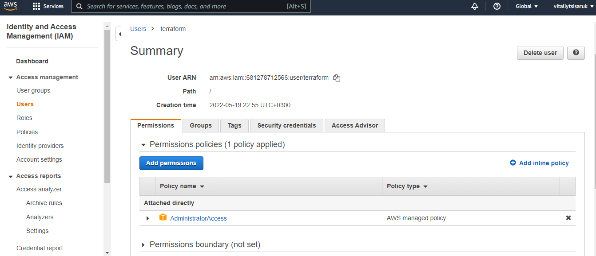

Also AWS CLI installed

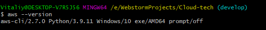

 

 

Elastic Container Registry

#### AWS and docker provider configuration with credentials 

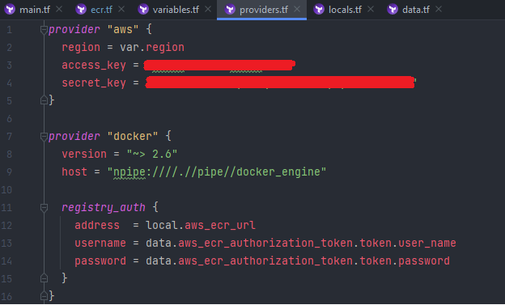
> aws_caller_identity and aws_ecr_authorization_token are data sources that automatically
exports credentials for an ECR

 

Defined variable of repositories as list and used the `for_each` meta-argument and `toset` function
to declare multiple similar resources

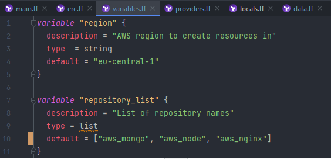

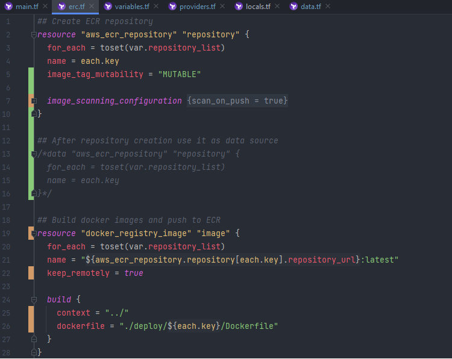

>After repos had been created, removed repo state from terraform, so it'd not be destroyed
when switching it to a data source

#### Created repositories: 

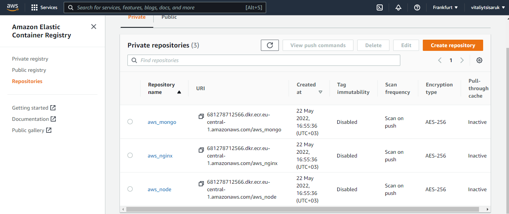

  
  
#### While building images, faced issue below and couldn't fix it.

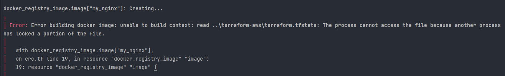
`docker_registry_image` strips the file permissions during handling of the context archive

https://github.com/kreuzwerker/terraform-provider-docker/issues/293

 
  
Thus i resorted to traditional method: built images using docker-compose,
tagged and push with docker cli commands

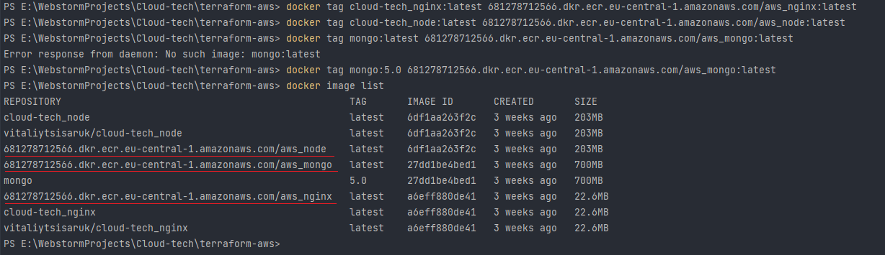
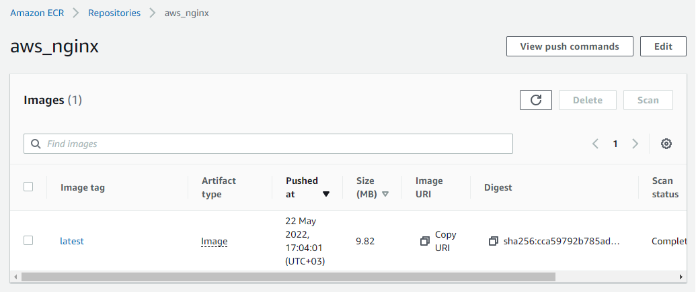
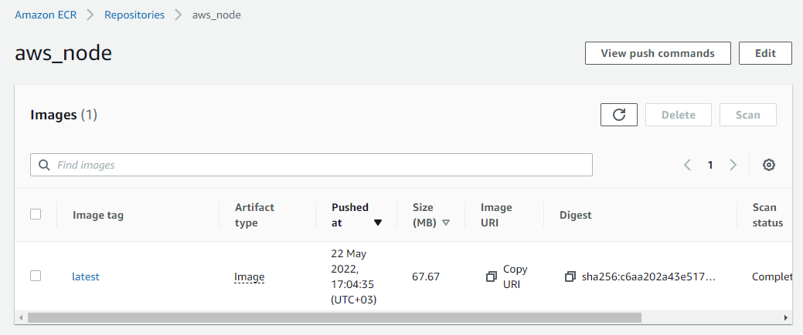
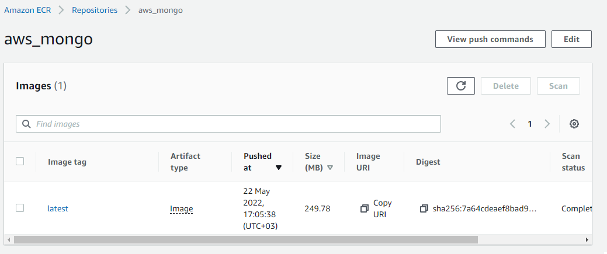

