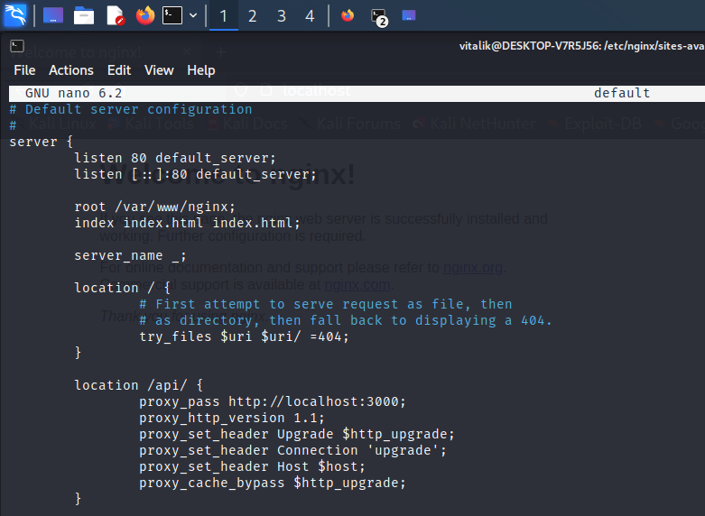
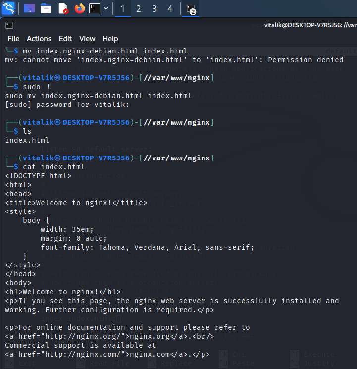
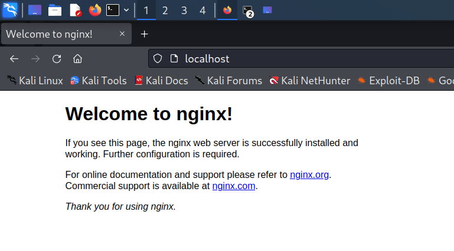
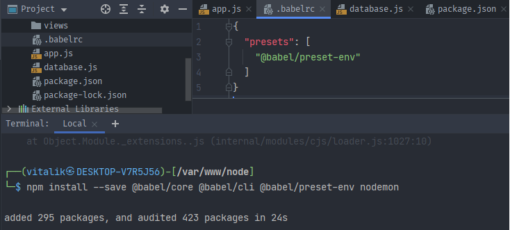
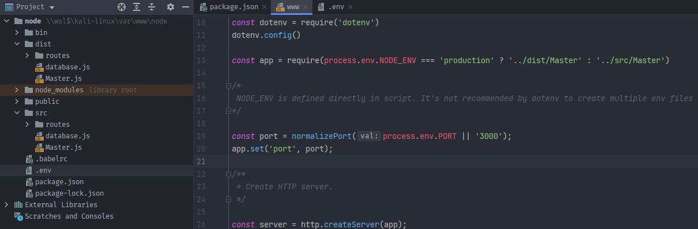
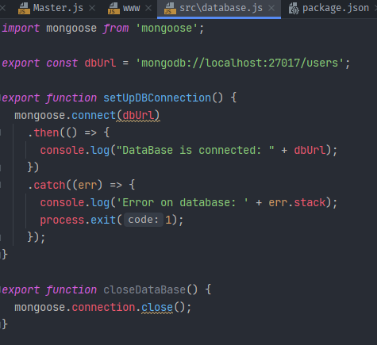
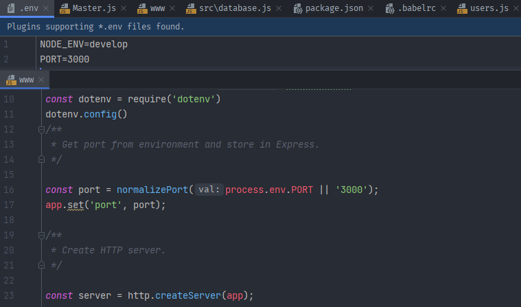
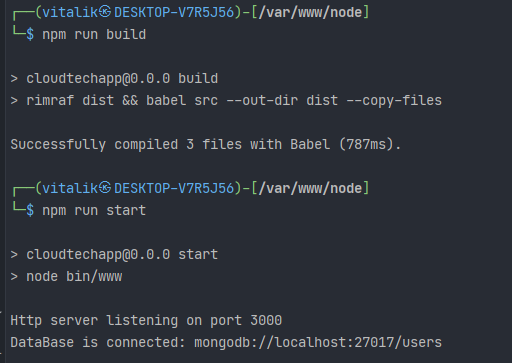

## LINUX NGINX MONGO NODE stack 

<details>
<summary>Nginx configuration</summary>

```nginx/sites-available/default```

Here i have two locations: '/' to service static
and '/api/' to service dynamic content in accordance 

'/api/' is proxying to 3000 port of localhost, there i'm gonna run backend application

It doesn't have any CORS configured yet







</details>
<br/>

<details>
<summary>Node express init</summary>

I should install http-server, that is Express.js, 
so my backend application could handle http requests

Make sure there're node.js installed in system


I used express generator package from npm:

https://www.npmjs.com/package/express-generator


Added response to '/' route


Verification whether it runs


Accessed localhost/api, after restarting both nginx and node 


### Amplified backend by enabling ES6 and hot reloading

ES6 code should be transpiled to ES5 so node could interpret it, 
so i'm gonna use 'babel' (note: there's a little configuration skipped)



As hot module replacement tool i used 'nodemon'.
It's incredibly important during development

Thus i have next scripts: 

* ```npm run build``` - to transpile code
* ```npm run start``` - to run www
* ```npm run dev``` - to run development server

They look as follows


Running build script a dist folder appears in project, 
then server can be launched from www by ```npm run start```
or ```node /bin/www```




</details>
<br/>

<details>
<summary>Mongo installation</summary>

First thing first i should replace systemctl utility, so it works without systemd

https://github.com/gdraheim/docker-systemctl-replacement


I chose to install Mongo 5.0:


Launched: 


</details>
<br/>

<details>
<summary>Mongo connection</summary>

I installed ORM mongoose to operate with database
<br/>
Setup file is described below:



The connection function is invoked from Master.js

```node
import {setUpDBConnection} from "./database.js";
setUpDBConnection();
```

Express doesn't serve http itself, there's a top layer that wraps express app in www file.
It's helpful if i'd like to use https in the future



Checking connection:



</details>
