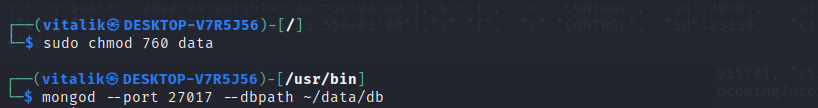

## LINUX NGINX MONGO NODE stack 

<details>
<summary>Nginx configuration</summary>

```nginx/sites-available/default```

Here i have two locations: '/' to service static
and '/api/' to service dynamic content in accordance 

'/api/' is proxying to 3000 port of localhost, there i'm gonna run backend application

It doesn't have any CORS configured yet


</details>
<br/>

<details>
<summary>Node express init</summary>

I should install http-server, that is Express.js, 
so my backend application could handle http requests

Make sure there're node.js installed in system


I used express generator package from npm:

https://www.npmjs.com/package/express-generator


Added response to '/' route


Verification whether it runs


Accessed localhost/api, after restarting both nginx and node 


</details>
<br/>

<details>
<summary>MongoDB installation</summary>

First thing first i should replace systemctl utility, so it works without systemd

https://github.com/gdraheim/docker-systemctl-replacement


I chose to install Mongo 5.0:




Launched: 


</details>
