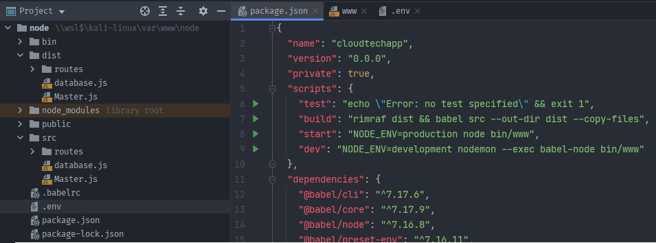
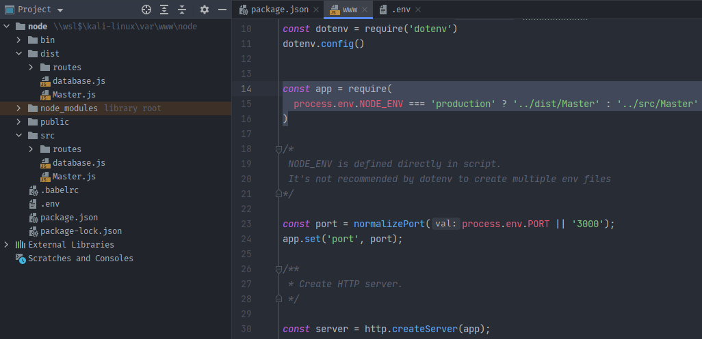
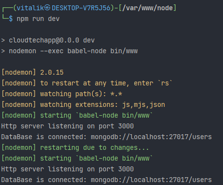
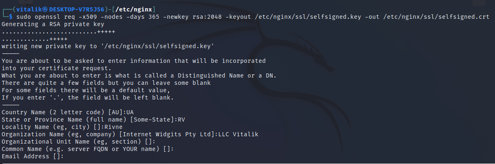
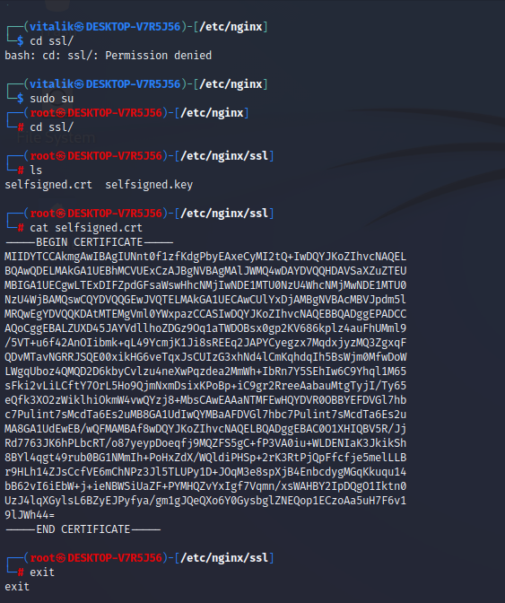
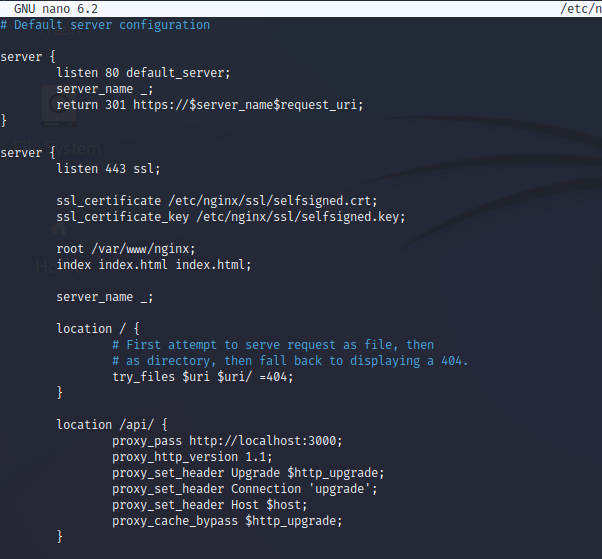
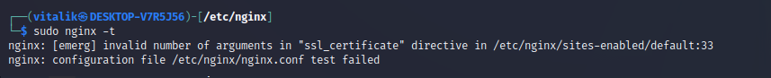
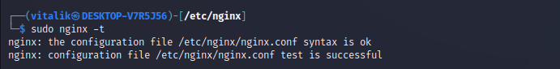
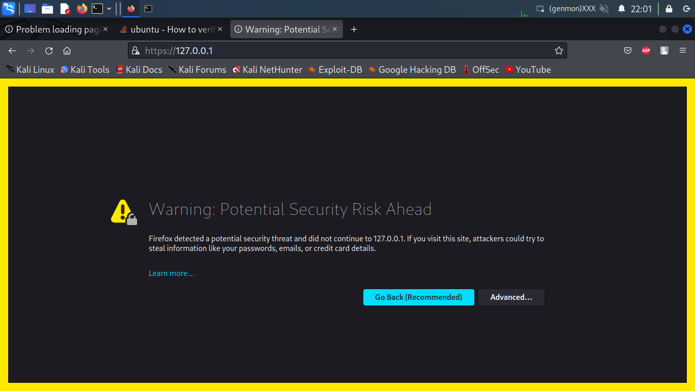
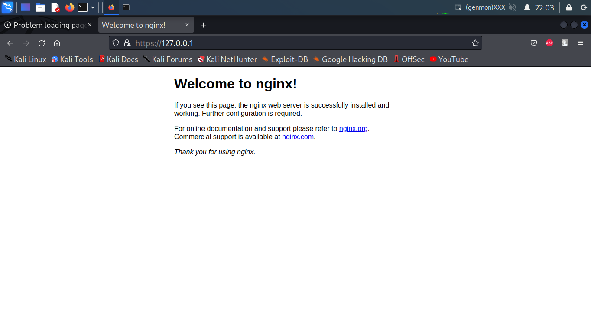

## LINUX NGINX MONGO NODE stack 

<details>
<br/>
<summary>Nginx configuration</summary>

`nginx/sites-available/default`

> Here i have two locations: `/` to service static
and `/api/` to service dynamic content in accordance 

> `/api/` is proxying to `3000` port of `localhost`, there's backend application gonna be run 

It doesn't have any CORS configured yet


Check html dom and nginx work:


</details>
<br/>

<details>
<br/>
<summary>Node express init</summary>

> I should install http-server, that is Express.js, 
so my backend application could handle http requests

Make sure there're node.js installed in system


I used express generator package from npm:

https://www.npmjs.com/package/express-generator


Added response to '/' route


Verification whether it runs


Localhost/api, after restarting both nginx and node 


### Amplified backend by enabling ES6 and hot reloading

> ES6 code should be transpiled to ES5 so node could interpret it, 
so i'm gonna use 'babel' (note: there's a little configuration skipped)


> As hot module replacement tool i used 'nodemon'.
It's incredibly important during development

```diff 
+ Thus i have next scripts:
```

* `npm run build` - to transpile code
* `npm run start` - to run www
* `npm run dev` - to run development server

They look as follows:



> Running build script leads to dist folder appearing in the project, 
then server can be launched from www by ```npm run start```
or ```NODE_ENV=production node /bin/www```



> Dev mode runs the same entry point `bin/www`, 
taking master app not from `dist` but `src` folder
<br/>
Checking its work:


</details>
<br/>

<details>
<br/>
<summary>Mongo installation</summary>

First thing first i should replace systemctl utility, so it works without systemd:

https://github.com/gdraheim/docker-systemctl-replacement


I chose to install Mongo 5.0:


Launched:


</details>
<br/>

<details>
<br/>
<summary>Mongo connection</summary>

I installed ORM mongoose to operate with database
<br/>
Setup file is described below:


The connection function is invoked from Master.js

```node
import {setUpDBConnection} from "./database.js";
setUpDBConnection();
```

Checking connection:


</details>
<br/>

<details>
<br/>
<summary>Setting up SSL</summary>
















</details>
