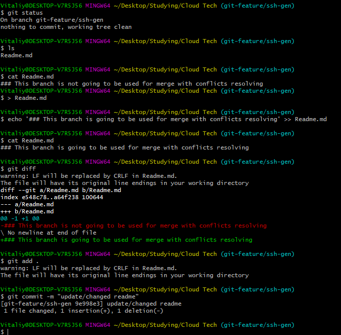
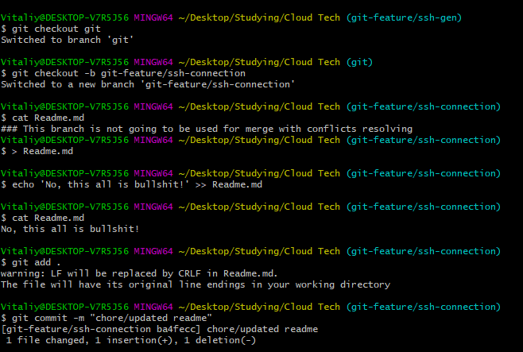
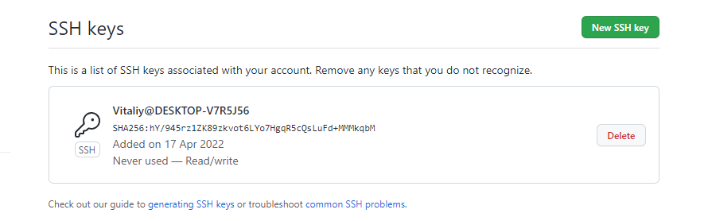
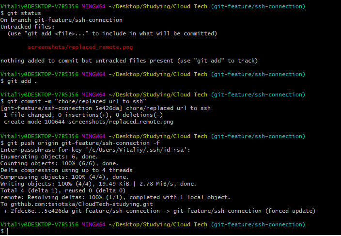
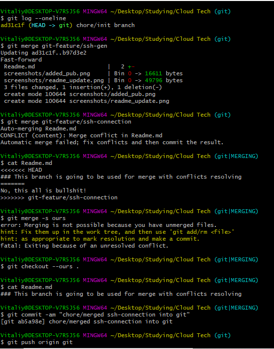

### This branch is going to be used for merge with conflicts resolving

> Created two additional branches `git-feature/ssh-gen` and `git-feature/ssh-connection`

**Made changes in Readme.md in both branches that are going to cause conflict:**

### SSH connection

**Used existing ssh keys pair and put public one to github:**

**Replaced remote url:**

**Added the above screenshot and tried to push:**

**Switched to main branch named `git`and merged developments of two other branches. 
Resolved conflict caused by changes in Readme.md that were made earlier**

**Deleted unnecessary branches and updated this doc with previously committed
screenshots of developments in appropriate branches**
