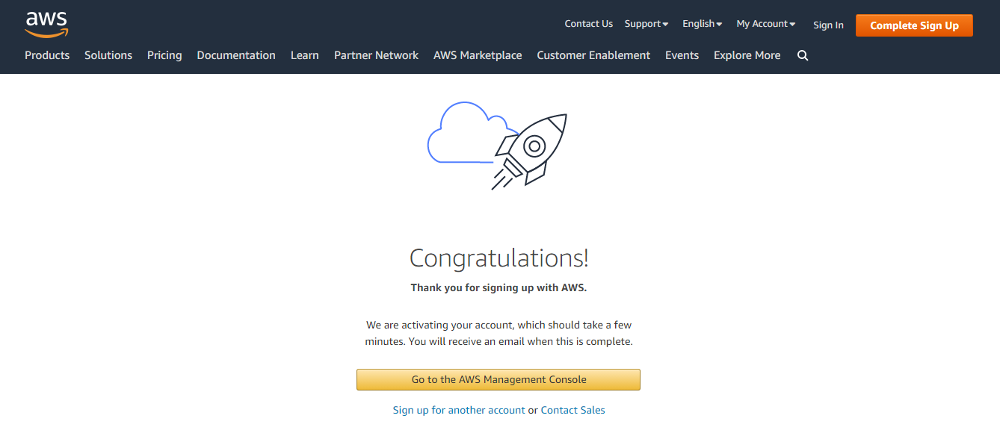
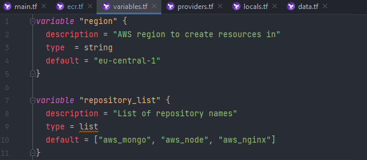
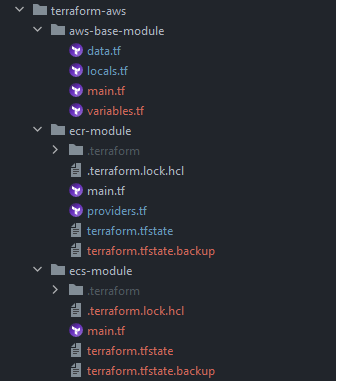
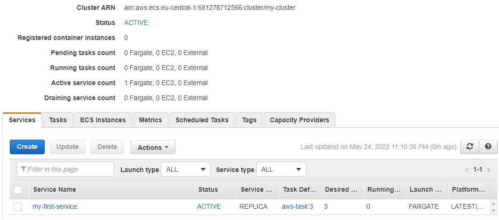

## Deploying an AWS ECS Cluster with Terraform

Registration and User creation

 

Also AWS CLI installed

 

Elastic Container Registry

#### AWS and docker provider configuration with credentials 

> aws_caller_identity and aws_ecr_authorization_token are data sources that automatically
exports credentials for an ECR

 

Defined variable of repositories as list and used the `for_each` meta-argument and `toset` function
to declare multiple similar resources

>After repos had been created, removed repo state from terraform, so it'd not be destroyed
when switching it to a data source

#### Created repositories: 

  
  
**While building images, faced issue below and couldn't fix it.**

`docker_registry_image` strips the file permissions during handling of the context archive

https://github.com/kreuzwerker/terraform-provider-docker/issues/293

 
  
Thus i resorted to traditional method: built images using docker-compose,
tagged and push with docker cli commands

 

Elastic Container Service

 

**Having second service i'd like to separate infra as follows:**

> So it consists of ECR and ECS modules with its own independent state  
and aws-base-module that represents abstraction.

ECS module is too way contentful, so:
https://github.com/tsiotska/CloudTech-studying/blob/aws/terraform-aws/ecs-module/main.tf

**For ECS there have been created next resources:**
* aws_iam_role (policy_arn: AmazonECSTaskExecutionRolePolicy)
* aws_ecs_cluster
* aws_ecs_service with load_balancer and network_configuration 
* aws_security_group for service network and load balancer
* single aws_ecs_task_definition with containers definitions referencing mongo, node, nginx images
* aws_default_vpc and aws_default_subnet

 

**Referencing by the DNS name it throws 503 error, 
as my nginx expects to work with ssl certificate 
and database requires initialization and output place specified, which is not done for now**

**But there are previously described successes:**
 

***

***

***

***

***

