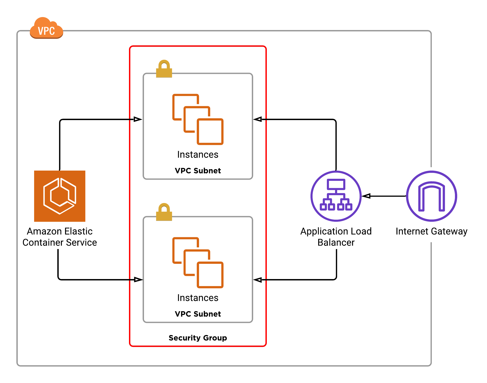

**To run locally with https:**

`docker-compose -f docker-compose.yaml up --build`

**To prebuild images for aws:**

`docker-compose -f docker-compose.yaml -f docker-compose.prod.yaml build`

**To enter container:**

docker exec -t -i container_id  /bin/sh

